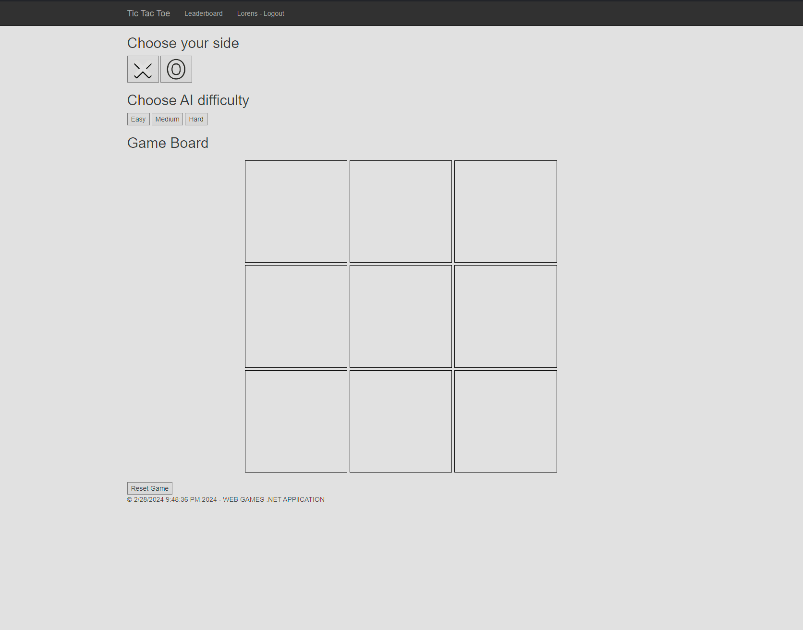
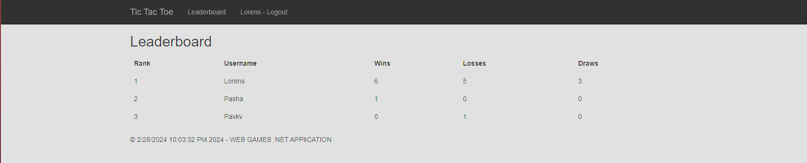

[![Contributors][contributors-shield]][contributors-url]
[![Forks][forks-shield]][forks-url]
[![Stargazers][stars-shield]][stars-url]
[![Issues][issues-shield]][issues-url]
[![MIT License][license-shield]][license-url]
[![LinkedIn][linkedin-shield]][linkedin-url]

<!-- PROJECT LOGO -->
 

  

<h3 align="center">TicTacFlow</h3>

  

    TicTacFlow: A vibrant and engaging online Tic Tac Toe platform that brings together casual and competitive gameplay with a sense of community and flow.
     
    <a href="https://github.com/Pavkv/TicTacFlow/blob/master/README.md"><strong>Explore the docs »</strong></a>
     
     
    <a href="https://tictacflow.azurewebsites.net">View Demo</a>
    ·
    <a href="https://github.com/Pavkv/TicTacFlow/issues">Report Bug</a>
    ·
    <a href="https://github.com/Pavkv/TicTacFlow/issues">Request Feature</a>
  

<!-- TABLE OF CONTENTS -->

  
Table of Contents

  <ol>
    <li>
      <a href="#about-the-project">About The Project</a>
      <ul>
        <li><a href="#built-with">Built With</a></li>
      </ul>
    </li>
    <li>
      <a href="#getting-started">Getting Started</a>
      <ul>
        <li><a href="#prerequisites">Prerequisites</a></li>
        <li><a href="#installation">Installation</a></li>
      </ul>
    </li>
    <li><a href="#usage">Usage</a></li>
    <li><a href="#roadmap">Roadmap</a></li>
    <li><a href="#contributing">Contributing</a></li>
    <li><a href="#license">License</a></li>
    <li><a href="#contact">Contact</a></li>
    <li><a href="#acknowledgments">Acknowledgments</a></li>
  </ol>

<!-- ABOUT THE PROJECT -->
## About The Project

**Game Board**

**Leaderboard**

TicTacFlow is a dynamic online platform designed to revolutionize the classic Tic Tac Toe game, offering an immersive experience that caters to both casual players and competitive enthusiasts. It features customizable game difficulties, user authentication for progress tracking, and a global leaderboard, all set within a community-focused environment that encourages interaction, strategy sharing, and continuous play.

(<a href="#readme-top">back to top</a>)

<!-- GETTING STARTED -->
## Getting Started

Welcome to TicTacFlow, the ultimate online Tic Tac Toe experience that connects players from around the globe in a competitive and interactive environment. Whether you're a casual player looking to pass the time or a competitive spirit seeking a challenge, TicTacFlow offers something for everyone. Follow this guide to get started and dive into the fun.

### Create an Account

* **Visit the TicTacFlow Website:** Open your preferred web browser and navigate to the TicTacFlow platform.
* **Sign Up:** Click on the "Sign Up" button on the homepage. Fill in the registration form with your details, including a nickname and a secure password.
* **Log In:** Return to the TicTacFlow website and log in with your new credentials.

### Choose Your Game Mode

1. Choose a side
   * **X or O:** Select your preferred side to play as, X or O.
2. Choose a difficulty
    * **Easy, Medium, or Hard:** Select the difficulty level that best suits your skill level and experience.

### Start Playing

* **Gameplay:** Click on the board to place your X or O. The goal is to get three in a row horizontally, vertically, or diagonally before your opponent.
* **Leaderboard:** Track your progress and compare your scores with other players on the global leaderboard.

(<a href="#readme-top">back to top</a>)

## Support and Feedback

If you encounter any issues or have suggestions for improving TicTacFlow, please reach out to our support team through the github page. We value your feedback and strive to make TicTacFlow the best online Tic Tac Toe platform.

Welcome to the community, and enjoy your time with TicTacFlow – where the classic game of Tic Tac Toe meets modern connectivity and competition.

(<a href="#readme-top">back to top</a>)

<!-- LICENSE -->
## License

Distributed under the MIT License. See `LICENSE.txt` for more information.

(<a href="#readme-top">back to top</a>)

<!-- CONTACT -->
## Contact

Pasha Zobov - [Linked In](https://www.linkedin.com/in/pavel-zobov-3a6365230/)

Project Link: [Tic Tac Flow]([https://tictacflow.azurewebsites.net])

(<a href="#readme-top">back to top</a>)

<!-- MARKDOWN LINKS & IMAGES -->
<!-- https://www.markdownguide.org/basic-syntax/#reference-style-links -->
[contributors-shield]: https://img.shields.io/github/contributors/Pavkv/PlayStationStoreDiscountBot.svg?style=for-the-badge
[contributors-url]: https://github.com/Pavkv/PlayStationStoreDiscountBot/graphs/contributors
[forks-shield]: https://img.shields.io/github/forks/Pavkv/PlayStationStoreDiscountBot.svg?style=for-the-badge
[forks-url]: https://github.com/Pavkv/PlayStationStoreDiscountBot/network/members
[stars-shield]: https://img.shields.io/github/stars/Pavkv/PlayStationStoreDiscountBot.svg?style=for-the-badge
[stars-url]: https://github.com/Pavkv/PlayStationStoreDiscountBot/stargazers
[issues-shield]: https://img.shields.io/github/issues/Pavkv/PlayStationStoreDiscountBot.svg?style=for-the-badge
[issues-url]: https://github.com/Pavkv/PlayStationStoreDiscountBot/issues
[license-shield]: https://img.shields.io/github/license/Pavkv/PlayStationStoreDiscountBot.svg?style=for-the-badge
[license-url]: https://github.com/Pavkv/TicTacFlow/blob/master/LICENSE.txt
[linkedin-shield]: https://img.shields.io/badge/-LinkedIn-black.svg?style=for-the-badge&logo=linkedin&colorB=555
[linkedin-url]: https://www.linkedin.com/in/pavel-zobov-3a6365230/
[product-screenshot]: images\example_screenshot.png
